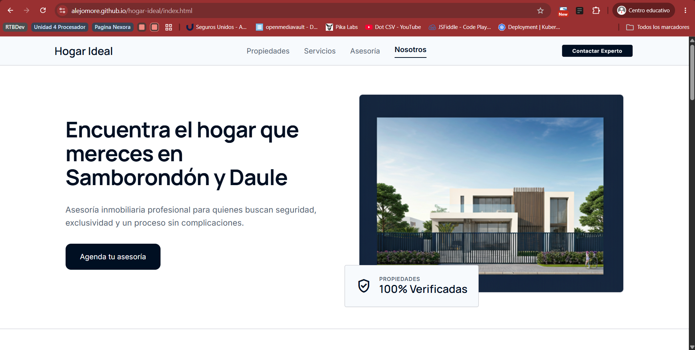

Hogar Ideal – Landing Page Inmobiliaria
Descripción General

Hogar Ideal es una página web estática enfocada en el sector inmobiliario premium en Ecuador.
El sitio fue desarrollado como proyecto académico de desarrollo web y tiene como objetivo ofrecer una experiencia moderna, elegante y responsive para usuarios interesados en propiedades de lujo.

La plataforma presenta información sobre:

Propiedades destacadas
Servicios inmobiliarios
Asesoría personalizada
Información corporativa de la empresa
Propósito del Sitio

El propósito principal del sitio es:

Mostrar propiedades inmobiliarias de manera visual y atractiva
Facilitar el contacto con asesores inmobiliarios
Generar confianza mediante una imagen corporativa profesional
Simular una plataforma inmobiliaria moderna orientada al mercado premium
Público Objetivo

El sitio está dirigido a:

Personas interesadas en comprar propiedades de lujo
Inversionistas inmobiliarios
Familias que buscan viviendas premium
Clientes interesados en asesoría inmobiliaria personalizada
Alcance del Proyecto

El proyecto incluye:

Diseño responsive
Navegación entre múltiples vistas
Interfaz moderna basada en Tailwind CSS
Formularios visuales de contacto
Secciones corporativas e informativas

Actualmente el sitio funciona como una landing page estática sin backend ni base de datos.

URL del Sitio Web
https://alejomore.github.io/hogar-ideal/index.html

Captura del Sitio Web

Tecnologías Utilizadas
HTML5
Tailwind CSS
Google Fonts
Material Symbols
GitHub Pages

Estructura del Proyecto
hogar-ideal/
│
├── index.html
├── servicios.html
├── asesoria.html
├── nosotros.html
│
├── assets/
│   ├── images/
│   └── styles/
│
├── README.md
└── estandar_codificacion_css.md

Características Principales
Diseño Responsive

Compatible con:

Desktop
Tablets
Smartphones
Navegación Moderna

Barra de navegación fija con acceso a:

Propiedades
Servicios
Asesoría
Nosotros
Diseño Corporativo Premium

Inspirado en:

Inmobiliarias de lujo
Interfaces minimalistas
Estética institucional moderna
